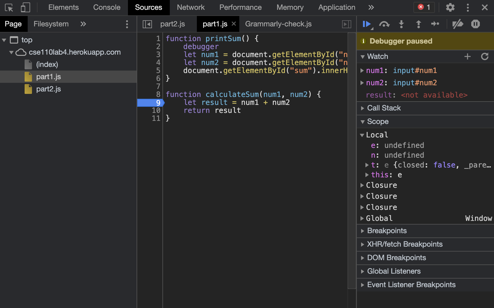

1. break point
   

2. watch expression
   

1. What was the bug?
   1+2 should be 3, but it prints 12
   it is adding the strings

2. How would you fix it? Include a screenshot of your fix.
    convert strings to numbers
    

1. What is the name of the new json file?
   citylots

2. Which file initiated the download of the new file?
   part2.js

3. What is its file size?
   11.7MB

4. How long did it take to download?
   8.69s

5. What was your User-Agent for the browser that made the request?
   Mozilla/5.0 (Macintosh; Intel Mac OS X 10_15_7) AppleWebKit/537.36 (KHTML, like Gecko) Chrome/88.0.4324.96 Safari/537.36

6. In the response, what type of server did it come from?
   Apache

7. When was the file last modified?
   Tue, 26 Jan 2021 22:14:13 GMT

8. What was the Content-Type of the file?
   application/json
